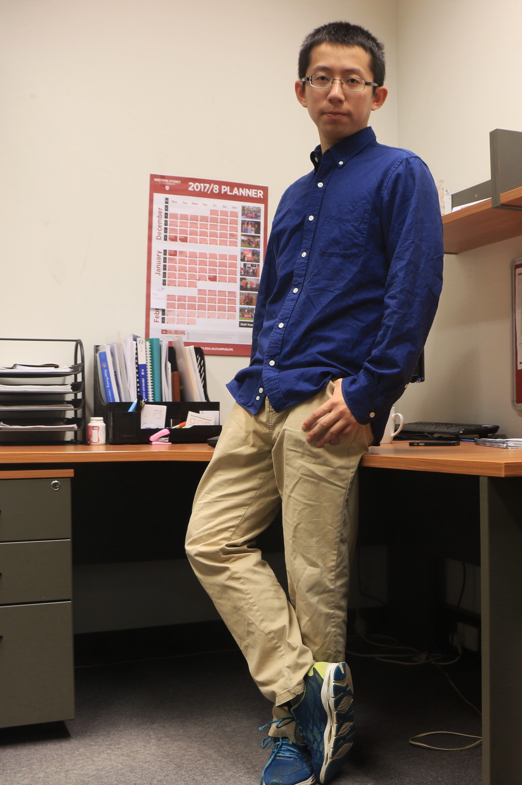

</style>

My research interest is twofold: second language speech perception/production and speech/language corpus. The first part is more on the psycholinguistic side, where I take an experimental approach to studying second language speech perception and production. My current PhD project, [Cognitive factors in perception and imitation of Thai tones by Mandarin and Vietnamese speakers]((https://www.westernsydney.edu.au/marcs/our_team/research_students/juqiang_chen)), falls into this category. I started wokring on my PhD in 2017 at [MARCS Institute for Brain, Behavior and Development](https://www.westernsydney.edu.au/marcs) with [Prof.Catherine Best](https://www.westernsydney.edu.au/marcs/our_team/researchers/professor_catherine_best), [Dr Mark Antoniou](https://www.westernsydney.edu.au/marcs/our_team/researchers/dr_mark_antoniou) and Dr.Benjawan Kasisopa. Before this, I graduated from [Nanjing University](https://www.nju.edu.cn/EN/) with a MA in Applied Linguistics in 2017.
 
 
The second part is more descriptive in nature and I am always enthusiastic about using coprus to document and explore patterns of language use.This is partially reflected in my current research assistant work with Mark Harvey, University of New Castle, and [Micheal Proctor](https://researchers.mq.edu.au/en/persons/michael-proctor), Macquarie University, on endangered aboriginal Australia Languages, **Arabana** and **Kaytetye** in particular, where I am responsible for data annotation, acoustic analysis, data visualizationa and statistical modelling.
 
 
**Contact:**
&ensp; [E-mail](j.chen2@westernsydney.edu.au) &ensp;  [Research Gate](https://www.researchgate.net/profile/Juqiang_Chen?ev=hdr_xprf&_sg=PLd--S4rAxP355beD9SM1NWekpEyCSV_oWPDxaa8_5hLBOmdyQJVSwqxv12hMo2PFyb3bv46jlgHK-plv-VTZhHJ) 
 
 

Curriculum Vitae

[CV pdf](CV_Juqiang.pdf)

#### Eudcation
2017-Now &ensp;**Ph.D.** &ensp;Psycholinguistics &ensp;  @[MARCS Institute, Western Sydney University](https://www.westernsydney.edu.au/marcs) 
 Supervisory panel: Prof. Catherine Best (primary); Dr. Mark Antoniou; Dr. Benjawan Kasisopa

2014-2017&ensp;	**M.A.** &ensp; Applied Linguistics &ensp; @[Nanjing University](https://www.nju.edu.cn/EN/) 
 Supervisor: Prof. Chen Hua

2009-2013	&ensp;**B.A.** &ensp; English linguistics &ensp; 	@[Nantong University](http://www.ntu.edu.cn)
 Supervisor: Dr. He Xuliang
 
 

####Manuscripts
#####In preparation
 
 

####Research

#####Peer-reviewed Conference papers

**Chen, J.**, Best, C. T., Antoniou, M., & Kasisopa, B. (2018). Cross-language categorisation of monosyllabic Thai tones by Mandarin and Vietnamese speakers: L1 phonological and phonetic influences. In J. Epps, J. Wolfe, J. Smith, & C. Jones (Eds.) *Proceedings of the Seventeenth Australasian International Conference on Speech Science and Technology*(pp. 168–172). 
 
 

#####Conference presentations

**Chen, J.**, Best, C. T., Antoniou, M., & Kasisopa, B. (2018).Mapping and comparing East and Southeast Asian language tones.Annual Conference of the Australian Linguistic Society (ALS). University of South Australia, Australia.

**Chen, J.** & Chen, H. (2016). Replanning mechanisms underlying L2 self-repairing: A timing study. Paper presented at the ICPEAL(16th), South China Normal University, Guangzhou, PRC.

**Chen, J.** (2016). The Phonetic Realization of Information Focus in English Declaratives: A Comparative Study Between Chinese English Learners and Native speakers. Paper presented at the EPCC(2016): Yanbian Univerisity, Yanji, PRC.
 
 

####Honours and Awards

2017-Present &ensp; **CSC-WSU Joint Scholarship** &ensp; China Scholarship Council, WSU

2016	 &ensp; **Academic Excellence Scholarship**  &ensp; 	Nanjing University

2014-2017	 &ensp; **National Academic Scholarship for Graduate Students** &ensp; 	Ministry of Education, P.R.C

2013 &ensp; **Excellent Bachelor Degree Thesis** &ensp; 	Nantong University

2011-2012	 &ensp; **National Student Encouragement Scholarship (three times)** &ensp; Department of Education, Jiangsu Province

2010-2012 &ensp; **First-class Student Scholarship (twice)** &ensp; Nantong University

2010 &ensp;	**National Student Scholarship** &ensp; 	Ministry of Education, P.R.C
 
 

####Research Assistantships
2018-2019  &ensp; **Arabana nasal Project.** &ensp;  University of Newcastle.  Supervisor: Mark Harvey; Robert Mailhammer

2018-2019  &ensp; **Kaytetye Project.** &ensp;  University of Newcastle.
 Supervisor: Mark Harvey; Michael Proctor
 
 

####Teaching

2014  &ensp; **College English (IELTS)** &ensp; Nanjing University

2013-2017  &ensp; **Freelance English language instructor.** &ensp; Global Education Centre , Nanjing, China
 
 

####Service

#####Professional Membership

*Australasian Speech Science and Technology Association* &ensp; 2017-Present

*Australian Linguistic Society*            &ensp;                2017-Present

*Association for Psychological Science*    &ensp;               2017-2018

*Acoustic Society of America*              &ensp;               2018-presemt

#####MARCS, University of Western Sydney

*MARCS Monday Meeting coordinator* &ensp; 2018

*Speech and language program meeting coordinator* &ensp; 2019

APSSC Campus Representative
 
 

###Language
Chinese (Native)  &ensp; English (Proficient, TOEFL:112); French (Intermediate)
 
 

###Technique skills

####Praat	Experienced user
Acoustic analysis with Praat scripts
 Spectrogram reading and IPA annotation
 Speech synthesis

####R	Good user
Data cleaning and wrangling : tidyr, dplyr
 Statistical modelling: GLM, GLMM, PCA, CA, SEM
 Data visualization: ggplot2

####Psychological experimental design
E-prime programming 

####Corpus linguistics/NLP with Python

